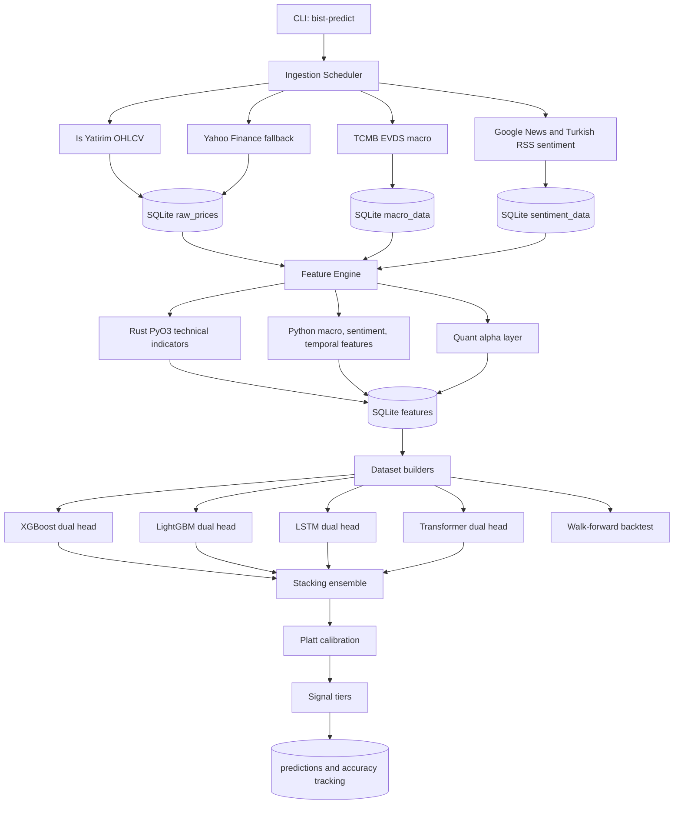
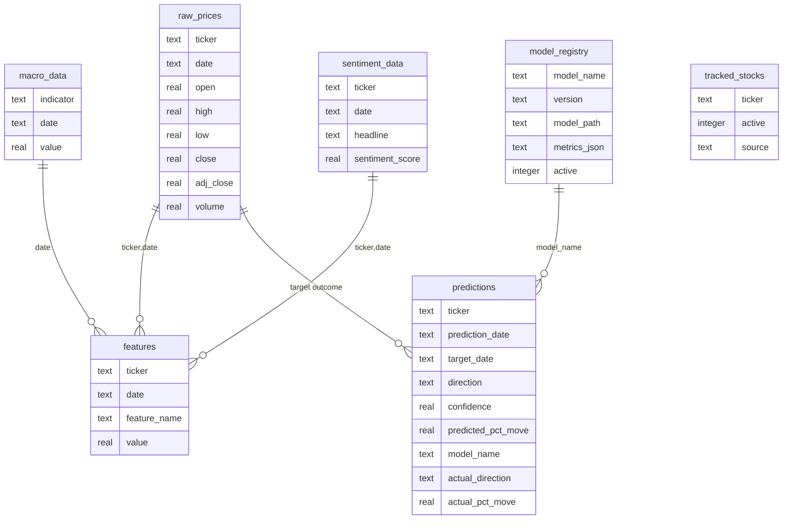
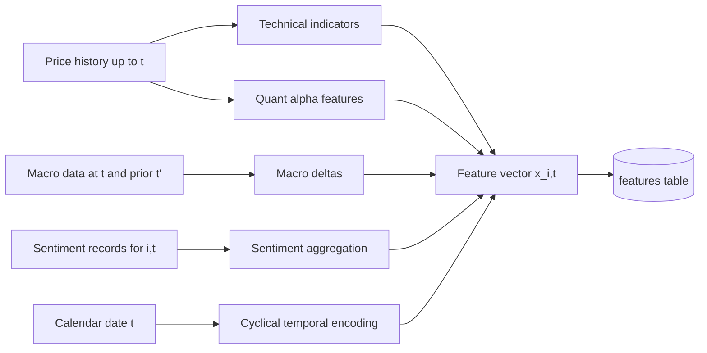
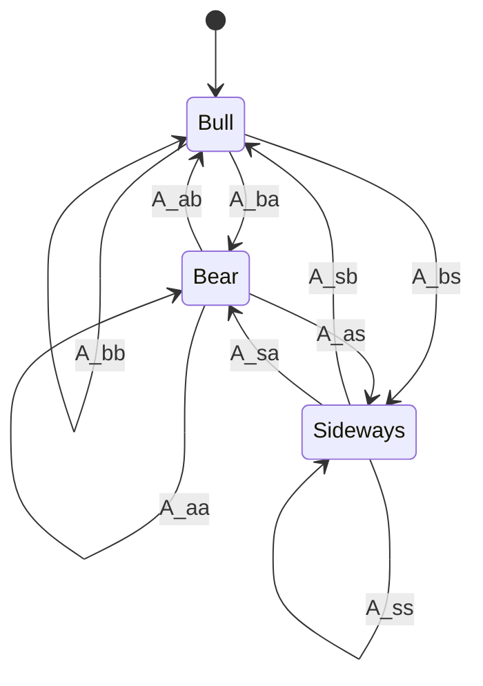
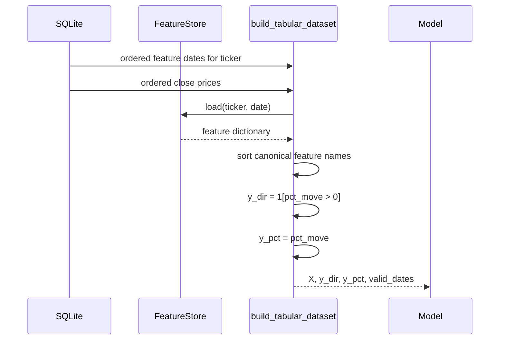

# BIST-Predict: A Hybrid Quantitative Machine Learning System for Daily BIST-100 Directional Forecasting

**Abstract.** This repository implements a CLI-operated research system for daily Borsa Istanbul equity forecasting. Given a stock universe $\mathcal{U}$, daily OHLCV observations, macroeconomic state variables, calendar variables, and news-derived sentiment, the system constructs a multi-modal feature tensor and estimates next-session directional probability $P(y_{i,t+1}=1 \mid \mathbf{x}_{i,t})$ together with a conditional percentage-return forecast $\hat{r}_{i,t+1}$. The implementation combines free market-data ingestion, a Rust/PyO3 technical-indicator engine, Python quantitative alpha modules, tabular gradient-boosted learners, sequential neural models, stacking, probability calibration, SQLite-backed model governance, walk-forward evaluation, and live accuracy tracking. The practical objective is not a single black-box classifier; it is an auditable research pipeline in which each transformation from raw market state to signal tier is represented as a typed, testable module.

**Keywords:** BIST-100, directional forecasting, XGBoost, LightGBM, LSTM, Transformer encoder, Platt calibration, Ornstein-Uhlenbeck process, GARCH(1,1), Hidden Markov Models, Kalman filtering, feature stores, walk-forward backtesting.

---

## Table of Contents

- [1. Research Problem](#1-research-problem)
- [2. System Architecture](#2-system-architecture)
- [3. Data and Storage Model](#3-data-and-storage-model)
- [4. Feature Construction](#4-feature-construction)
- [5. Quantitative Alpha Derivations](#5-quantitative-alpha-derivations)
- [6. Learning Algorithms](#6-learning-algorithms)
- [7. Calibration, Signal Tiers, and Decision Rule](#7-calibration-signal-tiers-and-decision-rule)
- [8. Evaluation Protocol](#8-evaluation-protocol)
- [9. Installation](#9-installation)
- [10. Quick Start](#10-quick-start)
- [11. CLI Commands](#11-cli-commands)
- [12. Configuration](#12-configuration)
- [13. Project Structure](#13-project-structure)
- [14. Testing](#14-testing)
- [15. Tech Stack and Data Sources](#15-tech-stack-and-data-sources)
- [16. Research Status and Limitations](#16-research-status-and-limitations)
- [17. License](#17-license)
- [18. Disclaimer](#18-disclaimer)

---

## 1. Research Problem

For stock $i \in \mathcal{U}$ and trading date $t$, let the observed state be

$$
\mathbf{s}_{i,t} =
\left[
O_{i,t}, H_{i,t}, L_{i,t}, C_{i,t}, V_{i,t},
\mathbf{m}_t, \mathbf{q}_{i,t}, \mathbf{c}_t
\right],
$$

where $O,H,L,C,V$ are open, high, low, close, and volume; $\mathbf{m}_t$ denotes macro variables from TCMB; $\mathbf{q}_{i,t}$ denotes ticker-level sentiment; and $\mathbf{c}_t$ denotes calendar state.

The supervised labels are next-observation direction and return:

$$
r_{i,t+1} = \frac{C_{i,t+1} - C_{i,t}}{C_{i,t}}, \qquad
y_{i,t+1} = \mathbb{1}\{r_{i,t+1} > 0\}.
$$

The repository estimates a dual-head predictive mapping:

$$
f_\theta(\mathbf{x}_{i,t}) =
\left(
\hat{p}_{i,t+1},
\hat{r}_{i,t+1}
\right),
\qquad
\hat{p}_{i,t+1} \approx P(y_{i,t+1}=1 \mid \mathbf{x}_{i,t}).
$$

The feature vector $\mathbf{x}_{i,t}$ is a deterministic transformation of historical prices, macro data, sentiment, and temporal encodings. The project is therefore a complete applied ML research stack: data generation, feature computation, model training, model registry, signal inference, and evaluation.

---

## 2. System Architecture



The implementation uses a layered design:

| Layer | Repository modules | Research function |
|-------|--------------------|-------------------|
| Ingestion | `src/bist_predict/ingest/` | Builds the empirical sample from free data sources with validation and fallback. |
| Storage | `src/bist_predict/storage/` | Persists raw observations, features, predictions, stock universe, and schema metadata. |
| Feature computation | `src/bist_predict/features/`, `rust/bist_features/` | Converts raw observations into a model-ready representation. |
| Quant alpha | `src/bist_predict/quant/` | Adds state-space, volatility, factor, regime, signal-quality, and risk features. |
| Models | `src/bist_predict/models/` | Implements tabular, sequential, ensemble, calibration, and registry abstractions. |
| Evaluation | `src/bist_predict/evaluation/` | Computes prediction metrics, trading metrics, walk-forward folds, and live accuracy. |
| Interface | `src/bist_predict/cli.py` | Exposes the research workflow as reproducible CLI commands. |

---

## 3. Data and Storage Model

The data model is explicitly time-indexed. This matters because the learning task is leakage-sensitive: features at $t$ must never include outcomes from $t+1$.



### 3.1 Ingestion Sources

| Data type | Source | Module | Notes |
|-----------|--------|--------|-------|
| BIST OHLCV | Is Yatirim API | `ingest/isyatirim.py` | Primary free price source. |
| BIST OHLCV fallback | Yahoo Finance | `ingest/yahoo.py` | Uses BIST suffix conventions through `yfinance`. |
| Macro indicators | TCMB EVDS | `ingest/tcmb.py` | Free key required for FX, rates, CPI, gold, and bond indicators. |
| Sentiment | Google News RSS, Turkish finance RSS | `ingest/sentiment.py` | Lightweight Turkish/finance headline scoring. |
| Validation | Internal quality module | `ingest/quality.py` | OHLCV consistency, missing-data gaps, and duplicate protection. |

### 3.2 Data Quality Constraints

For each price bar, the system enforces the admissible OHLCV region

$$
H_{i,t} \geq \max(O_{i,t}, C_{i,t}, L_{i,t}), \qquad
L_{i,t} \leq \min(O_{i,t}, C_{i,t}, H_{i,t}), \qquad
V_{i,t} \geq 0.
$$

Invalid observations are filtered before storage so that downstream feature functions receive a consistent sample.

---

## 4. Feature Construction

The feature engine computes $\mathbf{x}_{i,t}$ from at most 252 historical price observations ending at $t$. The resulting vector combines Rust-computed technical features, Python-computed macro/sentiment/calendar features, and quantitative alpha features.



### 4.1 Technical Indicator Basis

The Rust extension in `rust/bist_features/src/` exposes the high-throughput indicator basis through PyO3. Implemented functions include:

| Family | Features and functions |
|--------|------------------------|
| Momentum | RSI(14), MACD(12,26,9), stochastic `%K/%D`, Williams `%R`, CCI(20), MFI(14). |
| Trend | SMA and EMA over 5, 10, 20, 50, 100, and 200 sessions; ADX(14). |
| Volatility | Bollinger upper/middle/lower bands, Bollinger width, Bollinger position, ATR(14). |
| Volume | OBV, VWAP, 20-day volume ratio, raw volume. |
| Return state | Close, 1-day return, 5-day return, 20-day return. |
| Candlestick/cross-stock library | Pattern detection, correlation matrix, and beta are exposed by Rust and tested; the current feature orchestrator uses the indicator subset directly. |

Canonical examples:

$$
\text{SMA}_n(t) = \frac{1}{n}\sum_{k=0}^{n-1} C_{t-k},
\qquad
\text{EMA}_n(t) = \alpha C_t + (1-\alpha)\text{EMA}_n(t-1),
\quad
\alpha = \frac{2}{n+1}.
$$

For Bollinger features:

$$
\mu_{20,t} = \frac{1}{20}\sum_{k=0}^{19} C_{t-k}, \qquad
s_{20,t} = \sqrt{\frac{1}{19}\sum_{k=0}^{19}(C_{t-k}-\mu_{20,t})^2},
$$

$$
B_t^{upper} = \mu_{20,t} + 2s_{20,t}, \qquad
B_t^{lower} = \mu_{20,t} - 2s_{20,t}, \qquad
\text{BBPos}_t = \frac{C_t - B_t^{lower}}{B_t^{upper} - B_t^{lower}}.
$$

For VWAP:

$$
\text{VWAP}_t =
\frac{\sum_{\tau \leq t} \left(\frac{H_\tau + L_\tau + C_\tau}{3}\right)V_\tau}
{\sum_{\tau \leq t}V_\tau}.
$$

### 4.2 Macro Features

The macro module computes the current value, first difference, and relative difference for each configured TCMB indicator:

$$
\Delta m_{j,t} = m_{j,t} - m_{j,t^-},
\qquad
\delta m_{j,t} = \frac{m_{j,t} - m_{j,t^-}}{m_{j,t^-}},
$$

where $t^-$ is the previous available observation date for indicator $j$. Implemented indicator keys are:

| Indicator | Feature names |
|-----------|---------------|
| `USD_TRY` | `usd_try_value`, `usd_try_delta`, `usd_try_pct` |
| `EUR_TRY` | `eur_try_value`, `eur_try_delta`, `eur_try_pct` |
| `GOLD_TRY` | `gold_try_value`, `gold_try_delta`, `gold_try_pct` |
| `POLICY_RATE` | `policy_rate_value`, `policy_rate_delta`, `policy_rate_pct` |
| `CPI` | `cpi_value`, `cpi_delta`, `cpi_pct` |
| `BOND_2Y` | `bond_2y_value`, `bond_2y_delta`, `bond_2y_pct` |

### 4.3 Sentiment Features

For a ticker $i$, date $t$, and sentiment scores $a_{i,t,k}$, the system computes:

$$
\bar{a}_{i,t} = \frac{1}{K_{i,t}}\sum_{k=1}^{K_{i,t}}a_{i,t,k},
\qquad
\rho^+_{i,t} = \frac{1}{K_{i,t}}\sum_{k=1}^{K_{i,t}}\mathbb{1}\{a_{i,t,k} > 0\}.
$$

Stored sentiment features are `sentiment_mean`, `sentiment_count`, `sentiment_positive_ratio`, `sentiment_max`, and `sentiment_min`.

### 4.4 Temporal Features

Calendar periodicity is represented with both categorical-like flags and continuous cyclical encodings:

$$
d_t^{sin} = \sin\left(\frac{2\pi \cdot \text{dow}(t)}{7}\right),
\qquad
d_t^{cos} = \cos\left(\frac{2\pi \cdot \text{dow}(t)}{7}\right),
$$

with analogous month encodings. Additional tested calendar features include day of month, quarter, week of year, Monday/Friday flags, month-start flag, and month-end flag.

---

## 5. Quantitative Alpha Derivations

The quantitative layer is not treated as side metadata. It formalizes alternative hypotheses about return generation: trend persistence, mean reversion, latent regime, conditional volatility, cross-sectional factor exposure, and signal reliability.

### 5.1 Kalman Trend Filter

`quant/statistical.py` implements a two-dimensional state-space model:

$$
\begin{aligned}
\mathbf{z}_t &=
\begin{bmatrix}
\ell_t \\
v_t
\end{bmatrix}, &
\mathbf{F} &=
\begin{bmatrix}
1 & 1 \\
0 & 1
\end{bmatrix}, &
\mathbf{H} &=
\begin{bmatrix}
1 & 0
\end{bmatrix}, \\
\mathbf{z}_t &= \mathbf{F}\mathbf{z}_{t-1} + \mathbf{w}_t, &
C_t &= \mathbf{H}\mathbf{z}_t + \epsilon_t.
\end{aligned}
$$

Prediction and update:

$$
\hat{\mathbf{z}}_{t|t-1} = \mathbf{F}\hat{\mathbf{z}}_{t-1|t-1}, \qquad
\mathbf{P}_{t|t-1} = \mathbf{F}\mathbf{P}_{t-1|t-1}\mathbf{F}^\top + \mathbf{Q},
$$

$$
\mathbf{K}_t = \mathbf{P}_{t|t-1}\mathbf{H}^\top
\left(\mathbf{H}\mathbf{P}_{t|t-1}\mathbf{H}^\top + \mathbf{R}\right)^{-1},
$$

$$
\begin{aligned}
\hat{\mathbf{z}}_{t|t}
&= \hat{\mathbf{z}}_{t|t-1}
+ \mathbf{K}_t\left(C_t-\mathbf{H}\hat{\mathbf{z}}_{t|t-1}\right).
\end{aligned}
$$

Exported features: `kalman_trend`, `kalman_velocity`, `kalman_variance`.

### 5.2 Ornstein-Uhlenbeck Mean Reversion

The mean-reversion model assumes:

$$
dX_t = \theta(\mu - X_t)dt + \sigma dW_t.
$$

With discrete observations, the implementation estimates:

$$
\Delta X_t = a + bX_t + \varepsilon_t,
\qquad
\hat{\theta} = -\hat{b},
\qquad
\hat{\mu} = -\frac{\hat{a}}{\hat{b}}.
$$

The standardized deviation and signal are:

$$
z_t = \frac{X_t-\hat{\mu}}{\hat{\sigma}},
\qquad
s^{OU}_t = -z_t\hat{\theta}.
$$

Exported features: `ou_theta`, `ou_mu`, `ou_sigma`, `ou_deviation`, `ou_signal`.

### 5.3 GARCH(1,1) Volatility Forecast

The conditional variance model is:

$$
\sigma_t^2 = \omega + \alpha \epsilon_{t-1}^2 + \beta \sigma_{t-1}^2.
$$

The repository fits a zero-mean GARCH(1,1) process through the `arch` package, forecasts one-step volatility, annualizes it, and reports volatility surprise:

$$
\text{VolSurprise}_{t+1} =
\frac{|r_t|}{\hat{\sigma}_{t+1}}.
$$

Exported features: `garch_vol_forecast`, `garch_vol_surprise`, `garch_omega`, `garch_alpha`, `garch_beta`.

### 5.4 Hidden Markov Regime Model

The HMM uses observations:

$$
\mathbf{o}_t = [r_t, r_t^2],
$$

with latent regime $z_t \in \{1,\dots,K\}$, transition matrix $A$, and Gaussian emissions:

$$
P(z_t=j \mid z_{t-1}=i) = A_{ij},
\qquad
\mathbf{o}_t \mid z_t=k \sim \mathcal{N}(\boldsymbol{\mu}_k,\boldsymbol{\Sigma}_k).
$$

For $K=3$, states are labeled by mean return: lowest mean as bear, highest mean as bull, and the middle state as sideways. Exported values include current state and posterior bull/bear/sideways probabilities.



### 5.5 Momentum and Factor Models

Time-series momentum:

$$
R^{(L)}_{i,t} = \frac{C_{i,t} - C_{i,t-L}}{C_{i,t-L}},
\qquad
s^{TSMOM}_{i,t} =
\begin{cases}
+1, & R^{(L)}_{i,t} > 0, \\
-1, & R^{(L)}_{i,t} \leq 0.
\end{cases}
$$

Cross-sectional momentum ranks trailing cumulative returns into percentile scores. The adapted Fama-French module computes:

$$
\begin{aligned}
SMB_t &=
\frac{1}{|\mathcal{S}|}\sum_{i \in \mathcal{S}} r_{i,t}
- \frac{1}{|\mathcal{B}|}\sum_{i \in \mathcal{B}} r_{i,t}.
\end{aligned}
$$

$$
\begin{aligned}
HML_t &=
\frac{1}{|\mathcal{H}|}\sum_{i \in \mathcal{H}} r_{i,t}
- \frac{1}{|\mathcal{L}|}\sum_{i \in \mathcal{L}} r_{i,t}.
\end{aligned}
$$

then estimates stock exposures by OLS:

$$
r_{i,t} = \alpha_i + \beta_{i,m}MKT_t + \beta_{i,s}SMB_t + \beta_{i,h}HML_t + \epsilon_{i,t}.
$$

### 5.6 Signal Quality and Risk

Information coefficient:

$$
IC_t = \rho_{Spearman}(\hat{r}_{:,t}, r_{:,t}).
$$

Kelly fraction:

$$
f^* = \frac{pb - q}{b},
\qquad q = 1-p,
$$

with fractional sizing $f = \lambda f^*$, where the default implementation uses conservative fractional Kelly.

Ledoit-Wolf shrinkage estimates covariance as:

$$
\hat{\Sigma}_{LW} = \lambda \mathbf{T} + (1-\lambda)\mathbf{S},
$$

where $\mathbf{S}$ is the empirical covariance matrix and $\mathbf{T}$ is a structured shrinkage target.

PCA factor extraction solves:

$$
\max_{\mathbf{w}_k:\|\mathbf{w}_k\|_2=1}
\mathbf{w}_k^\top \Sigma \mathbf{w}_k,
$$

subject to orthogonality constraints for later components.

---

## 6. Learning Algorithms

The repository defines a shared `PredictionModel` protocol. Every model returns:

$$
\begin{aligned}
\left(\hat{p}_{i,t+1}, \hat{r}_{i,t+1}\right)
&= \mathrm{model.predict}\left(\mathbf{x}_{i,t}\right).
\end{aligned}
$$

### 6.1 Dataset Construction

The tabular dataset builder joins stored features and next-day closes:



For sequential models, `build_sequence_dataset` converts tabular snapshots into:

$$
\mathbf{X}^{seq}_{n} =
\left[
\mathbf{x}_{t-L},
\mathbf{x}_{t-L+1},
\dots,
\mathbf{x}_{t-1}
\right]
\in \mathbb{R}^{L \times d}.
$$

### 6.2 Dual-Head Objective

The tree and neural models optimize separate direction and return heads. For neural models, the combined loss is:

$$
\begin{aligned}
\mathcal{L}_{BCE}(\theta)
&=
-\frac{1}{N}\sum_{n=1}^{N}
\left[
y_n\log \hat{p}_n + (1-y_n)\log(1-\hat{p}_n)
\right], \\
\mathcal{L}_{MSE}(\theta)
&=
\frac{1}{N}\sum_{n=1}^{N}(\hat{r}_n-r_n)^2, \\
\mathcal{L}(\theta)
&= \mathcal{L}_{BCE}(\theta) + \mathcal{L}_{MSE}(\theta).
\end{aligned}
$$

For XGBoost and LightGBM, the classifier and regressor heads are fitted as independent estimators over the same feature matrix.

### 6.3 Model Library

| Model | Module | Input | Output heads | Current operational status |
|-------|--------|-------|--------------|----------------------------|
| XGBoost | `models/xgboost_model.py` | Tabular $N \times d$ | classifier + regressor | Trained by CLI. |
| LightGBM | `models/lightgbm_model.py` | Tabular $N \times d$ | classifier + regressor | Trained by CLI. |
| LSTM | `models/lstm_model.py` | Sequence $N \times L \times d$ | sigmoid direction + linear return | Implemented, tested, protocol-compatible. |
| Transformer | `models/transformer_model.py` | Sequence $N \times L \times d$ | sigmoid direction + linear return | Implemented, tested, protocol-compatible. |

### 6.4 LSTM Representation

The LSTM state transition is:

$$
\begin{aligned}
\mathbf{i}_t &= \sigma(W_i\mathbf{x}_t + U_i\mathbf{h}_{t-1} + \mathbf{b}_i),\\
\mathbf{f}_t &= \sigma(W_f\mathbf{x}_t + U_f\mathbf{h}_{t-1} + \mathbf{b}_f),\\
\mathbf{o}_t &= \sigma(W_o\mathbf{x}_t + U_o\mathbf{h}_{t-1} + \mathbf{b}_o),\\
\tilde{\mathbf{c}}_t &= \tanh(W_c\mathbf{x}_t + U_c\mathbf{h}_{t-1} + \mathbf{b}_c),\\
\mathbf{c}_t &= \mathbf{f}_t \odot \mathbf{c}_{t-1} + \mathbf{i}_t \odot \tilde{\mathbf{c}}_t,\\
\mathbf{h}_t &= \mathbf{o}_t \odot \tanh(\mathbf{c}_t).
\end{aligned}
$$

The repository maps the final hidden state to two heads:

$$
\hat{p}_{t+1} = \sigma(g_{dir}(\mathbf{h}_T)),
\qquad
\hat{r}_{t+1} = g_{reg}(\mathbf{h}_T).
$$

### 6.5 Transformer Representation

The Transformer encoder first projects feature vectors into $d_{model}$, adds sinusoidal positional encodings, then applies multi-head self-attention:

$$
\text{Attention}(Q,K,V) =
\text{softmax}\left(\frac{QK^\top}{\sqrt{d_k}}\right)V.
$$

For head $h$:

$$
\text{head}_h =
\text{Attention}(XW_h^Q, XW_h^K, XW_h^V),
\qquad
\text{MHA}(X) =
\text{Concat}(\text{head}_1,\dots,\text{head}_H)W^O.
$$

The final token representation is used for the direction and return heads.

### 6.6 Stacking Ensemble

The ensemble combiner stacks model outputs into meta-features:

$$
\mathbf{z}^{dir}_{n} =
\left[
\hat{p}^{(1)}_n,\dots,\hat{p}^{(M)}_n
\right],
\qquad
\mathbf{z}^{ret}_{n} =
\left[
\hat{r}^{(1)}_n,\dots,\hat{r}^{(M)}_n
\right].
$$

Direction stacking uses logistic regression:

$$
\hat{p}^{ens}_n =
\sigma\left(\alpha + \boldsymbol{\beta}^{\top}\mathbf{z}^{dir}_{n}\right),
$$

and return stacking uses ridge regression:

$$
\hat{\boldsymbol{\beta}} =
\arg\min_{\boldsymbol{\beta}}
\left\|
\mathbf{y}^{ret} - \mathbf{Z}^{ret}\boldsymbol{\beta}
\right\|_2^2
+ \lambda \left\|\boldsymbol{\beta}\right\|_2^2.
$$

If the meta-learner is not trained, predictions fall back to simple averaging.

---

## 7. Calibration, Signal Tiers, and Decision Rule

### 7.1 Platt Scaling

The calibration module fits:

$$
P(y=1 \mid a) =
\frac{1}{1+\exp(Aa+B)},
$$

where $a$ is an uncalibrated score or raw probability transformed as a scalar input. This turns confidence into an empirical probability statement.

### 7.2 Signal Tier Function

For direction $d$ and confidence $c$, the signal-tier function is:

$$
\tau(d,c) =
\begin{cases}
\text{STRONG BUY}, & d=\text{UP}, c \geq 0.80,\\
\text{BUY}, & d=\text{UP}, 0.70 \leq c < 0.80,\\
\text{STRONG SELL}, & d=\text{DOWN}, c \geq 0.80,\\
\text{SELL}, & d=\text{DOWN}, 0.70 \leq c < 0.80,\\
\text{HOLD}, & \text{otherwise}.
\end{cases}
$$

The inference path currently loads active XGBoost and LightGBM models from the model registry. If a model expects a different feature dimension than the latest feature row, that ticker/model pair is skipped to prevent schema-incompatible inference.

---

## 8. Evaluation Protocol

### 8.1 Walk-Forward Backtesting

The backtest engine constructs folds:

$$
\mathcal{D}^{train}_k =
\{t_k,\dots,t_k+W_{train}-1\},
\qquad
\mathcal{D}^{val}_k =
\{t_k+W_{train},\dots,t_k+W_{train}+W_{val}-1\}.
$$

With defaults $W_{train}=252$, $W_{val}=63$, and step size $21$, each validation block is strictly later than its training block.

```mermaid
gantt
    title Walk-forward validation geometry
    dateFormat  X
    axisFormat %s
    section Fold 1
    Train 1 :0, 252
    Validate 1 :252, 63
    section Fold 2
    Train 2 :21, 252
    Validate 2 :273, 63
    section Fold 3
    Train 3 :42, 252
    Validate 3 :294, 63
```



Trading costs are applied on entry and exit:

$$
r^{net} = r^{gross} - 2c_{commission} - 2c_{slippage}.
$$

### 8.2 Prediction Metrics

`evaluation/metrics.py` computes:

$$
\text{Accuracy} = \frac{TP+TN}{TP+TN+FP+FN},
\qquad
\text{Precision} = \frac{TP}{TP+FP},
\qquad
\text{Recall} = \frac{TP}{TP+FN},
$$

$$
F_1 = \frac{2 \cdot \text{Precision}\cdot \text{Recall}}
{\text{Precision}+\text{Recall}},
\qquad
\text{Brier} = \frac{1}{N}\sum_{n=1}^{N}(\hat{p}_n-y_n)^2,
$$

$$
\text{MAE}_{ret} =
\frac{1}{N}\sum_{n=1}^{N}
|\hat{r}_n-r_n|.
$$

The AUC-ROC is computed where class diversity permits it.

### 8.3 Trading Metrics

For daily strategy returns $R_t$:

$$
\text{Sharpe} =
\frac{\mathbb{E}[R_t-r_f/252]}{\sqrt{\text{Var}(R_t-r_f/252)}}\sqrt{252},
$$

$$
\text{Sortino} =
\frac{\mathbb{E}[R_t-r_f/252]}{\sqrt{\text{Var}(\min(R_t-r_f/252,0))}}\sqrt{252},
$$

$$
\begin{aligned}
\text{MaxDrawdown} &=
\min_t
\frac{
\prod_{\tau \leq t}(1+R_\tau)
- \max_{u \leq t}\prod_{\tau \leq u}(1+R_\tau)
}{
\max_{u \leq t}\prod_{\tau \leq u}(1+R_\tau)
}.
\end{aligned}
$$

Additional tracked metrics include win rate, profit factor, average win/loss ratio, Calmar ratio, and total return.

---

## 9. Installation

### Prerequisites

- Python 3.12+
- [uv](https://docs.astral.sh/uv/) (recommended) or pip
- Rust toolchain for the Rust feature engine
- Homebrew `libomp` on macOS, required by XGBoost: `brew install libomp`

### Install

```bash
# Clone the repository
git clone <repo-url>
cd BIST-Predictorcl

# Install Python dependencies
uv sync

# Optional: build the Rust feature engine for maximum performance
cd rust/bist_features
maturin develop --release
cd ../..
```

If the Rust module is not compiled, the system falls back to Python-only feature computation. Macro, sentiment, temporal, and quantitative features still work; Rust technical indicators are unavailable until the extension is built.

---

## 10. Quick Start

```bash
# 1. Fetch market data (last 90 days)
uv run bist-predict fetch --days 90

# 2. Compute features for all stocks
uv run bist-predict features

# 3. Train prediction models
uv run bist-predict train

# 4. Get today's trading signals
uv run bist-predict signals

# 5. Check prediction accuracy
uv run bist-predict accuracy
```

End-to-end pipeline command:

```bash
uv run bist-predict pipeline --days 365
uv run bist-predict pipeline --days 365 --ticker THYAO --detail
```

---

## 11. CLI Commands

### `bist-predict fetch`

Pull latest market data from all sources.

```bash
uv run bist-predict fetch                    # Fetch last 30 days for all stocks
uv run bist-predict fetch --days 90          # Fetch last 90 days
uv run bist-predict fetch --ticker THYAO     # Fetch a single stock
```

Fetches OHLCV prices, TCMB macro indicators when an API key is configured, and Google News sentiment records. The scheduler uses Is Yatirim as the primary price source and Yahoo Finance as fallback. Incremental fetching only requests dates newer than the latest stored date.

### `bist-predict features`

Compute features from stored raw data.

```bash
uv run bist-predict features                           # Backfill missing feature dates
uv run bist-predict features --ticker THYAO             # Single stock
uv run bist-predict features --date 2026-03-15          # Specific date
```

Runs the full feature pipeline: Rust technical indicators when available, quantitative alpha features, macro deltas, sentiment aggregation, and temporal features. Results are stored in SQLite keyed by `(ticker, date, feature_name)`.

### `bist-predict train`

Train or retrain prediction models.

```bash
uv run bist-predict train                    # Train on all stocks
uv run bist-predict train --ticker THYAO     # Train on one stock only
uv run bist-predict train --models xgboost,lightgbm
uv run bist-predict train --include-neural --seq-len 30
```

Builds chronological keyed datasets from the feature store, trains active base models, fits a stacking ensemble on validation predictions, applies Platt calibration when validation labels contain both classes, saves model artifacts, and registers active versions in the model registry. The default remains the fast tabular ensemble (`xgboost,lightgbm`); LSTM and Transformer training is opt-in through `--include-neural`.

### `bist-predict signals`

Get current trading signals.

```bash
uv run bist-predict signals                  # All stocks
uv run bist-predict signals --ticker THYAO   # Single stock
uv run bist-predict signals --detail         # Detailed breakdown including HOLD
```

When an active calibrated ensemble exists, `signals` loads the ensemble plus its active base models and emits one ensemble signal per ticker. If no ensemble is active, it falls back to the active tabular base models. Example output:

```text
========================================
  STRONG BUY
========================================
  THYAO    85.2% conf  +1.42% target  (xgboost)
  GARAN    82.1% conf  +0.98% target  (lightgbm)

========================================
  BUY
========================================
  AKBNK    74.3% conf  +0.67% target  (xgboost)
```

### `bist-predict pipeline`

Run fetch, feature generation, training, and signal generation end to end.

```bash
uv run bist-predict pipeline
uv run bist-predict pipeline --days 365
uv run bist-predict pipeline --ticker THYAO --detail
```

### `bist-predict backtest`

Run walk-forward backtest.

```bash
uv run bist-predict backtest
uv run bist-predict backtest --ticker THYAO
uv run bist-predict backtest --train-window 252 --val-window 63 --step-size 21
```

Runs a leakage-aware walk-forward research simulation. Each fold trains base models on the earliest fold segment, trains the stacker and calibrator on a later in-fold meta segment, evaluates on the forward validation segment, applies commission and slippage to long/short paper positions, and prints prediction and trading metrics. This is a research backtest, not an execution engine or financial advice.

### `bist-predict accuracy`

Show prediction accuracy history.

```bash
uv run bist-predict accuracy                 # Top 5 stocks
uv run bist-predict accuracy --ticker THYAO  # Single stock with confidence buckets
```

For a single ticker, this also displays confidence bucket analysis across 60-70%, 70-80%, 80-90%, and 90-100% confidence ranges.

### `bist-predict stocks`

List all tracked stocks from the persistent DB universe.

```bash
uv run bist-predict stocks
```

### `bist-predict config`

Display current configuration.

```bash
uv run bist-predict config
```

---

## 12. Configuration

Create a `config.toml` in the project root:

```toml
[data]
tcmb_api_key = ""           # Free key from evds2.tcmb.gov.tr
fetch_retries = 3           # Max retries per data source
rate_limit_delay = 1.0      # Seconds between API calls

[signals]
min_confidence = 0.70       # Minimum confidence to display signal
lookback_days = 30          # Feature computation lookback

[models]
retrain_interval = "monthly" # Retrain cadence
ensemble_weights = "learned" # "learned" or "equal"
active_models = "xgboost,lightgbm"
include_neural = false
seq_len = 30
validation_fraction = 0.2

[quant]
hmm_states = 3              # HMM regime states: bull, bear, sideways
kelly_fraction = 0.25       # Fractional Kelly multiplier
hurst_window = 252          # Hurst exponent lookback window

[backtest]
commission = 0.001          # 0.1% per trade
slippage = 0.0005           # 0.05% per trade
```

---

## 13. Project Structure

```text
BIST-Predictorcl/
+-- README.md
+-- pyproject.toml
+-- config.example.toml
+-- Cargo.toml
+-- Cargo.lock
+-- uv.lock
|
+-- src/bist_predict/
|   +-- cli.py
|   +-- config.py
|   |
|   +-- ingest/
|   |   +-- isyatirim.py
|   |   +-- yahoo.py
|   |   +-- tcmb.py
|   |   +-- sentiment.py
|   |   +-- scheduler.py
|   |   +-- quality.py
|   |   +-- types.py
|   |
|   +-- features/
|   |   +-- engine.py
|   |   +-- store.py
|   |   +-- macro_features.py
|   |   +-- sentiment_features.py
|   |   +-- temporal_features.py
|   |
|   +-- quant/
|   |   +-- factors.py
|   |   +-- statistical.py
|   |   +-- risk.py
|   |   +-- signal_quality.py
|   |   +-- regime.py
|   |
|   +-- models/
|   |   +-- types.py
|   |   +-- xgboost_model.py
|   |   +-- lightgbm_model.py
|   |   +-- lstm_model.py
|   |   +-- transformer_model.py
|   |   +-- ensemble.py
|   |   +-- calibration.py
|   |   +-- registry.py
|   |
|   +-- evaluation/
|   |   +-- backtest.py
|   |   +-- metrics.py
|   |   +-- tracker.py
|   |
|   +-- storage/
|       +-- database.py
|       +-- migrations.py
|
+-- rust/bist_features/
|   +-- Cargo.toml
|   +-- src/
|       +-- lib.rs
|       +-- indicators.rs
|       +-- patterns.rs
|       +-- correlations.rs
|
+-- tests/
    +-- test_ingest/
    +-- test_features/
    +-- test_quant/
    +-- test_models/
    +-- test_evaluation/
    +-- test_storage/
    +-- test_cli.py
    +-- conftest.py
```

---

## 14. Testing

```bash
# Run all tests
uv run pytest tests/ -v

# Run by module
uv run pytest tests/test_ingest/ -v        # Data ingestion tests
uv run pytest tests/test_features/ -v      # Feature engine tests
uv run pytest tests/test_quant/ -v         # Quantitative alpha tests
uv run pytest tests/test_models/ -v        # ML model tests
uv run pytest tests/test_evaluation/ -v    # Evaluation tests
uv run pytest tests/test_storage/ -v       # Storage tests

# Run a single test
uv run pytest tests/test_models/test_xgboost_model.py::TestXGBoostModel::test_predict_better_than_random -v
```

Current collection snapshot:

```bash
uv run pytest --collect-only -q
```

The command collected 221 tests in the current workspace. The test suite covers ingestion, feature stores, Rust indicators and patterns, quantitative alpha modules, model protocols, calibration, model registry behavior, backtesting folds, trading metrics, storage, and CLI helper logic.

| Module | Coverage focus |
|--------|----------------|
| `tests/test_ingest/` | Price clients, macro client, sentiment feeds, validation, scheduler fallback, integration cycle. |
| `tests/test_features/` | Feature engine, macro/sentiment/temporal features, store CRUD, Rust indicators, Rust correlations, Rust candlestick patterns. |
| `tests/test_quant/` | Momentum, OU, Fama-French, Kalman, GARCH, HMM, cointegration, Hurst, wavelets, IC, Kelly, PCA, regime routing. |
| `tests/test_models/` | XGBoost, LightGBM, LSTM, Transformer, ensemble, calibration, registry, dataset builders, prediction dataclass. |
| `tests/test_evaluation/` | Walk-forward folds, transaction costs, prediction metrics, trading metrics, live accuracy tracking. |
| `tests/test_storage/` | Database initialization, schema creation, stock universe seeding, raw price CRUD. |

---

## 15. Tech Stack and Data Sources

### 15.1 Tech Stack

| Component | Technology |
|-----------|------------|
| Language | Python 3.12+, Rust |
| CLI | Click |
| HTTP | httpx |
| Market data | yfinance, custom Is Yatirim client |
| RSS | feedparser |
| Tabular ML | XGBoost, LightGBM |
| Neural ML | PyTorch LSTM and Transformer encoder |
| Quant libraries | scipy, statsmodels, hmmlearn, arch, PyWavelets |
| ML utilities | scikit-learn |
| Rust binding | PyO3, maturin |
| Storage | SQLite |
| Build and environment | uv, Cargo |
| Tests | pytest, pytest-asyncio, respx |

### 15.2 Data Sources

All data sources are free and require no paid subscription:

| Source | Data | API key required |
|--------|------|------------------|
| [Is Yatirim](https://www.isyatirim.com.tr) | BIST OHLCV prices | No |
| [Yahoo Finance](https://finance.yahoo.com) | BIST OHLCV prices fallback | No |
| [TCMB EVDS](https://evds2.tcmb.gov.tr) | FX, rates, CPI, gold, bond indicators | Yes, free registration |
| [Google News RSS](https://news.google.com) | Ticker-level headlines | No |
| Turkish finance RSS feeds | Finance headline sentiment | No |

---

## 16. Research Status and Limitations

This repository is an applied research system, not a production trading desk. Important implementation facts:

- The default CLI training path activates a calibrated XGBoost/LightGBM stacking ensemble; LSTM and Transformer models remain opt-in because they are slower to train and verify locally.
- The ensemble combiner and Platt calibrator are integrated into the default inference path when an active ensemble is registered.
- The Rust module exposes candlestick pattern detection, correlations, and beta; the current feature engine directly uses the indicator subset and price-derived features.
- CLI-level walk-forward orchestration is available for research simulation with realistic commission and slippage assumptions.
- The system depends on free public data sources, so availability, schema stability, and latency can vary.

---

## 17. License

GNU General Public License v3.0

---

## 18. Disclaimer

This software is for educational and research purposes only. It is not financial advice. Past performance does not guarantee future results. Always do your own research before making investment decisions. The authors assume no liability for losses incurred from using this system.
